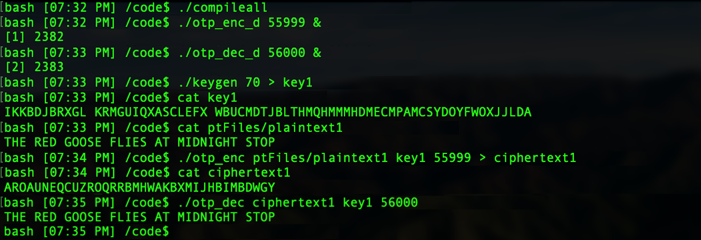

#  Cryptography

###### Operates a one-time-pad encryption and decryption service using client-server architecture highlighting multiprocessing and inter-process communication.

## Requirements
- gcc compiler
- POSIX compliant OS
- Input requirements: Text files with upper case letters and spaces. No other characters allowed.

## Usage

*** Your 'HOME' environment variable must be set to your working directory. ***

Compile programs: `./compileall`

1. Start the encryption and decryption servers

  ##### Encryption server

  `./otp_enc_d <port number A> &`    

  e.g. `./otp_enc_d 38475 &`

  ##### Decryption server

  `./otp_dec_d <port number B> &`

  e.g. `./otp_dec_d 92834 &`

  The servers run as background process "daemons" each connected to a socket on 'localhost' as written. Allows an unlimited number of connections and any ports available on your system. The servers are independent and you can choose to run one or both as you wish.

2. Make key

  ##### Keygen
  `./keygen <number of chars> > <keyfile>`

  e.g. `./keygen 700 > key.txt`

  Outputs random characters with the same character restrictions for input. The number of chars must be greater than or equal to the length of your file you wish to encrypt.

3. Client connects to the server

  ##### Encryption client
  `./otp_enc <plaintext> <key> <port number of server>`

  e.g. `./otp_enc plaintext1 key.txt 38475`

  ##### Decryption client
  `./otp_dec <ciphertext> <key> <port number of server>`

  e.g. `./otp_dec ciphertext1 key.txt 92834`

  The encryption server receives plaintext and the key and returns ciphertext. The decryption server receives ciphertext and the key and returns plaintext.

## Output
The encryption client outputs ciphertext and the decryption client outputs plaintext. The ciphertext and plaintext are sent from the servers to their respective clients which then output the data.

#### Test Script

Run p4gradingscript for a full test. This uses a known set of plaintext files located in ptFiles. If these files are modified or deleted p4gradingscript may not execute correctly.

 `./p4gradingscript <encryption server port> <decryption server port>`

 e.g. `./p4gradingscript 45999 46000`
